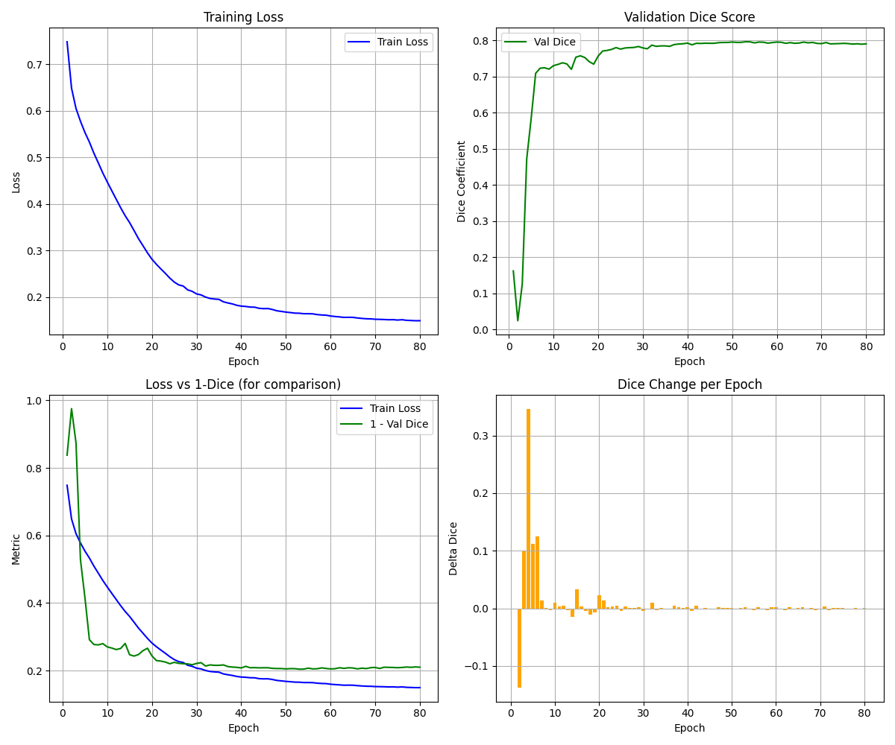
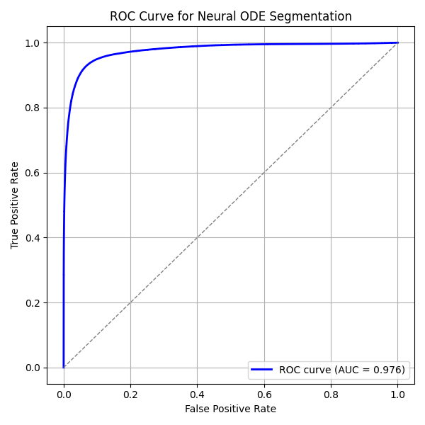
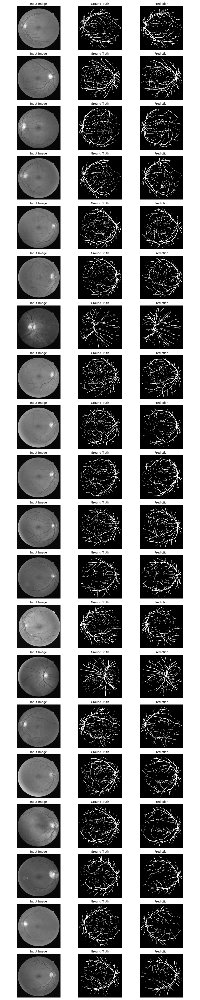

# Neural ODE–U-Net for Retinal Vessel Segmentation


A deep learning architecture that combines U-Net with Neural Ordinary Differential Equations (Neural ODEs) for accurate retinal blood vessel segmentation. This hybrid approach leverages continuous-time dynamics to improve vessel connectivity and reduce boundary artifacts in medical image analysis.

## 🎯 Features

- **Neural ODE Integration**: Continuous-depth transformation at the bottleneck for smoother feature evolution
- **Advanced Preprocessing**: CLAHE enhancement, green channel extraction, and normalization
- **Comprehensive Postprocessing**: Morphological operations, Frangi filtering, and skeleton reconnection
- **High Performance**: Superior Dice coefficient, Jaccard index, and sensitivity metrics
- **Visualization Tools**: Training curves, ROC analysis, and prediction comparisons

## 📋 Table of Contents

- [Project Structure](#project-structure)
- [Dataset](#dataset)
- [Model Architecture](#model-architecture)
- [Results](#results)
- [Citation](#citation)

## 📁 Project Structure

```
.
├── RetinaSegmentation.ipynb    # Main training notebook
├── FlowChart.mmd               # Architecture diagram (Mermaid)
├── FlowChart_HD.png            # Architecture visualization
├── train/                      # Training dataset
│   ├── image/                  # Training images (80 samples)
│   └── mask/                   # Ground truth masks
├── test/                       # Test dataset
│   ├── image/                  # Test images (20 samples)
│   └── mask/                   # Ground truth masks
├── files/
│   └── checkpoint.pth          # Training checkpoint (118 MB)
├── ode_unet_results/           # Model outputs
│   ├── ode_unet_best.pth       # Best model weights (12 MB)
│   ├── pred_epoch_*/           # Predictions per epoch
│   ├── training_performance.png
│   ├── roc_curve.png
│   ├── test_metrics.png
│   └── sample_predictions.png
└── results/                    # Visualization outputs
    ├── final/                  # Final predictions
    ├── intermediate/           # Preprocessing stages
    │   ├── green/              # Green channel extraction
    │   ├── clahe/              # CLAHE enhancement
    │   └── gamma/              # Gamma correction
    └── postprocessing/         # Post-processed results
```

## 📊 Dataset

The project uses retinal fundus images with corresponding vessel masks:

- **Training Set**: 80 images
- **Test Set**: 20 images
- **Image Size**: 584×565 pixels
- **Format**: PNG (RGB images, binary masks)

### Data Preprocessing

1. **Green Channel Extraction**: Isolates the green channel for optimal vessel contrast
2. **CLAHE Enhancement**: Contrast Limited Adaptive Histogram Equalization
3. **Gamma Correction**: Adaptive brightness adjustment
4. **Normalization**: Zero-mean, unit variance scaling

## 🏗️ Model Architecture

### Overview

The Neural ODE–U-Net consists of five main components:

1. **Encoder**: Hierarchical feature extraction with residual connections
2. **Neural ODE Bottleneck**: Continuous-time feature transformation
3. **Decoder**: Symmetric upsampling with skip connections
4. **Loss Function**: Hybrid Dice + Binary Cross-Entropy
5. **Postprocessing**: Morphological refinement and vessel enhancement

### Neural ODE Bottleneck

The core innovation uses continuous-depth dynamics:

$$\frac{dh(t)}{dt} = f_{\theta}(h(t), t)$$

Solved using Dopri5 (adaptive Runge-Kutta):

$$h(1) = \text{ODESolve}(h(0), f_{\theta}, t \in [0, 1])$$

### Loss Function

Hybrid loss combining Dice similarity and BCE:

$$\mathcal{L} = -\alpha \cdot \text{Dice} - (1 - \alpha) \cdot \text{BCE}$$

Where:

- $\text{Dice}(P, G) = \frac{2|P \cap G|}{|P| + |G|}$
- $\text{BCE} = -[G \log P + (1 - G) \log(1 - P)]$

## 📈 Results

### Performance Metrics

| Metric           | Value      |
| ---------------- | ---------- |
| Dice Coefficient | **0.7981** |
| Jaccard Index    | **0.6641** |
| Accuracy         | **0.9647** |
| Precision        | **0.7983** |
| Recall           | **0.7979** |

### Visualizations

Results include:

- **Training Performance**: Loss and metric curves across epochs
  
- **ROC Curves**: True positive vs false positive rates
  
- **Sample Predictions**: Side-by-side comparison with ground truth
  
- **Preprocessing Steps**: Visualization of intermediate stages
- **Postprocessing Effects**: Before/after enhancement comparison

## 🔬 Key Advantages

- **Continuous Feature Evolution**: Smoother gradient flow through Neural ODE
- **Memory Efficient**: Adaptive ODE solver with checkpointing
- **Better Vessel Connectivity**: Reduced disconnections in thin vessels
- **Topology Preservation**: Improved handling of bifurcations and crossovers
- **Generalization**: Applicable to other biomedical segmentation tasks

## 📝 Citation

If you use this code in your research, please cite:

```bibtex
@article{neural-ode-unet,
  title={Neural ODE–U-Net for Retinal Vessel Segmentation},
  author={Bishnu Prasad Kar},
  year={2025}
}
```

## 📄 License

This project is licensed under the MIT License - see the LICENSE file for details.

## 🙏 Acknowledgments

- U-Net architecture by Ronneberger et al. (2015)
- Neural ODE framework by Chen et al. (2018)
- Retinal vessel segmentation datasets

## 📧 Contact

For questions or collaboration opportunities, please open an issue or contact [karbishnu2430@gmail.com]

---

**Note**: This is a research implementation. For clinical applications, please ensure proper validation and regulatory compliance.
